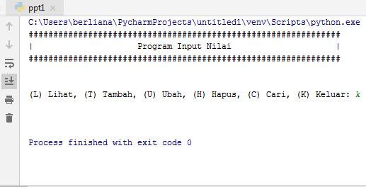
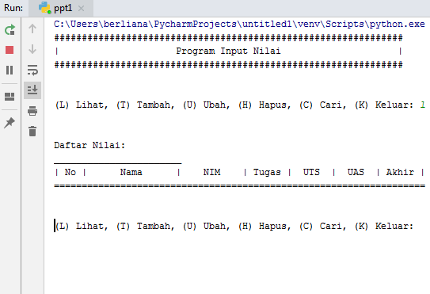

# PERTEMUAN9
TUGAS DIBUAT UNTUK MEMENUHI TUGAS PADA PERTEMUAN 9
 

##  Nama:Berliana Noviansyah
## Kelas:TI.20.A1
## NIM:312010373
## MATKUL: BAHASA PEMROGRAMAN
___________________________________________________________________________________\
## Program Data Mahasiswa
pada praktikum 4 ini, saya akan membuat program sederhana untuk menginput data kedalam list.

### Membuat perintah "keluar"
Kali ini kita akan membuat perintah "keluar" dengan baris perintah sebagai berikut

```python
    if menu.lower() == 'k':
        break
```


<br>

### Membuat perintah "lihat"
dan ini adalah baris perintah untuk membuat perintah "lihat"

```python
    elif menu.lower() == 'l':
        print("Daftar Nilai:")
        print("_______________________")
        print("| No |      Nama      |    NIM    | Tugas |  UTS  |  UAS  | Akhir |")
        print("===================================================================")
        no = 1
        for tabel in data.values():
            print("| {0:2} | {1:14} | {2:9} | {3:5} | {4:5} | {5:5} | {6:5} |".format
                  (no, tabel[0],
                   tabel[1], tabel[2],
                   tabel[3], tabel[4], tabel[5]))
            no += 1
```


### Membuat baris perintah "tambah"
kali ini kita akan membuat baris perintah "tambah" untuk menambahkan data kedalam syntax database tersebut, berikut adalah baris perintahnya:

```python
    elif menu.lower() == 't':
        print("Masukan data mahasiswa")
        print("...")
        nama = input("Masukan nama: ")
        nim = input("Masukan NIM: ")
        nilai_tugas = int(input("Masukan nilai tugas: "))
        nilai_uts = int(input("Masukan nilai UTS: "))
        nilai_uas = int(input("Masukan nilai UAS: "))
        nilai_akhir = (nilai_tugas)*30/100 + (nilai_uts)*35/100 + (nilai_uas)*35/100 
        data[nama] = [nama, nim, nilai_tugas, nilai_uts, nilai_uas, nilai_akhir]
        print('\nData berhasil di tambah!')
        print("_______________________")
        print("| No |      Nama      |    NIM    | Tugas |  UTS  |  UAS  | Akhir |")
        print("===================================================================")
        no = 1
        for tabel in data.values():
            print("| {0:2} | {1:14} | {2:9} | {3:5} | {4:5} | {5:5} | {6:5} |".format
                  (no, tabel[0],
                   tabel[1], tabel[2],
                   tabel[3], tabel[4], tabel[5]))
            no += 1
```


### Membuat pintasan ubah dalam database dibawah

```python
# Ubah
    elif menu.lower() == 'u':
        nama = input("Masukan nama untuk mengubah data: ")
        if nama in data.keys():
            print("Mau mengubah apa?")
            sub_data = input("(Semua), (Nama), (NIM), "
                         "(Tugas), (UTS), (UAS) : ")
            if sub_data.lower() == "semua":
                print("==========================")
                print("Ubah data {}.".format(nama))
                print("==========================")
                data[nama][1] = input("Ubah NIM:")
                data[nama][2] = int(input("Ubah Nilai Tugas: "))
                data[nama][3] = int(input("Ubah Nilai UTS: "))
                data[nama][4] = int(input("Ubah Nilai UAS: "))
                data[nama][5] = data[nama][2] *30/100 + data[nama][3]*35/100 + data[nama][4] *35/100 
                print("\nBerhasil ubah data!")
                print("_______________________")
                print("| No |      Nama      |    NIM    | Tugas |  UTS  |  UAS  | Akhir |")
                print("===================================================================")
                no = 1
                for tabel in data.values():
                    print("| {0:2} | {1:14} | {2:9} | {3:5} | {4:5} | {5:5} | {6:5} |".format
                        (no, tabel[0],
                        tabel[1], tabel[2],
                        tabel[3], tabel[4], tabel[5]))
                    no += 1
            elif sub_data.lower() == "nim":
                data[nama][1] = input("NIM:")
                print('Data berhasil di ubah!')
            elif sub_data.lower() == "tugas":
                data[nama][2] = int(input("Nilai Tugas: "))
                print('Data berhasil di ubah!')
            elif sub_data.lower() == "uts":
                data[nama][3] = int(input("Nilai UTS: "))
                print('Data berhasil di ubah!')
            elif sub_data.lower() == "uas":
                data[nama][4] = int(input("Nilai UAS: "))
                print('Data berhasil di ubah!')
            else:
                print("menu tidak ditemukan.")

        else:
            print("'{}' tidak ditemukan.".format(nama))
```


<br>

## Berikut Inputannya :
nilai = []
ulang = True

while ulang:
    nama = input("Masukkan Nama: ")
    nim = input("Masukkan NIM: ")
    tugas = int(input("Masukkan Nilai Tugas: "))
    uts = int(input("Masukkan Nilai UTS: "))
    uas = int(input("Masukkan Nilai UAS: "))
    akhir = (tugas * 30/100) + (uts * 35/100) + (uas * 35/100)

    nilai.append([nama, nim, tugas, uts, uas, int(akhir)])
    if (input("Tambah data (y/t)?") == 't'):
        ulang = False

print("\n                      Daftar Nilai Mahasiswa")
print("==================================================================")
print("|No. |     Nama     |    NIM    | Tugas |  UTS  |  UAS  |  Akhir |")
print("==================================================================")
i = 0
for item in nilai:
    i += 1
    print("| {no:2d} | {nama:12s} | {nim:9s} | {tugas:5d} | {uts:5d} | {uas:5d} | {akhir:6.2f} |"
          .format(no=i, nama=item[0], nim=item[1], tugas=item[2], uts=item[3], uas=item[4], akhir=item[5]))
print("==================================================================")
Setelah Kita memasukan inputan dibawah ini ini lah hasil inputan Tersebut


 
Dan Setelah Kita Menemukan Hasil Nya Mari Saya Jelaskan Perinciannya

1.) Langkah  Pertama  Yang Harus Lakukan Adalahkita membuat variable list kosong.

nilai = []
ulang = True
Variable ulang = True digunakan untuk mengontrol perulangan.

2.) Setelah itu  kita membuat kondisi perulangan dan statement yang akan dijalankan ketika perulangan terjadi.
    Dan Ini inputannya
    while ulang:
    nama = input("Masukkan Nama: ")
    nim = input("Masukkan NIM: ")
    tugas = int(input("Masukkan Nilai Tugas: "))
    uts = int(input("Masukkan Nilai UTS: "))
    uas = int(input("Masukkan Nilai UTS: "))
    akhir = (tugas * 30/100) + (uts * 35/100) + (uas * 35/100)

    nilai.append([nama, nim, tugas, uts, uas, int(akhir)])
 Dari statement  yang kita masukan diatas, kita akan diminta untuk menginput nama, nim, nilai tugas, nilai uts, dan nilai uas, lalu system akan menjumlahkan nilai-nilai tersebut dan menghasilkan nilai akhir. Setelah menginput berbagai data atau item, inputan item tersebut akan masuk ke dalam list 'nilai'
 3.) Setelah membuat perulangan, kita membuat statement untuk menghentikan atau keluar dari perulangan yang terjadi.

    if (input("Tambah data (y/t)?") == 't'):
        ulang = False
Untuk keluar dari perulangan kita hanya perlu menginputkan 't' apabila diminta pada saat program dijalankan. 't' akan membuat variable ulang = True menjadi ulang = False yang mana akan menghentikan perulangan yang terjadi.

4.) Terakhir kita akan mencetak hasil dari program yang telah dibuat.

print("\n                      Daftar Nilai Mahasiswa")
print("==================================================================")
print("|No. |     Nama     |    NIM    | Tugas |  UTS  |  UAS  |  Akhir |")
print("==================================================================")
i = 0
for item in nilai:
    i += 1
    print("| {no:2d} | {nama:12s} | {nim:9s} | {tugas:5d} | {uts:5d} | {uas:5d} | {akhir:6.2f} |"
          .format(no=i, nama=item[0], nim=item[1], tugas=item[2], uts=item[3], uas=item[4], akhir=item[5]))
print("==================================================================")
Setelah ini selanjutnya kita akan membuat flowcart Sebagai Berikut


# Terimakasih